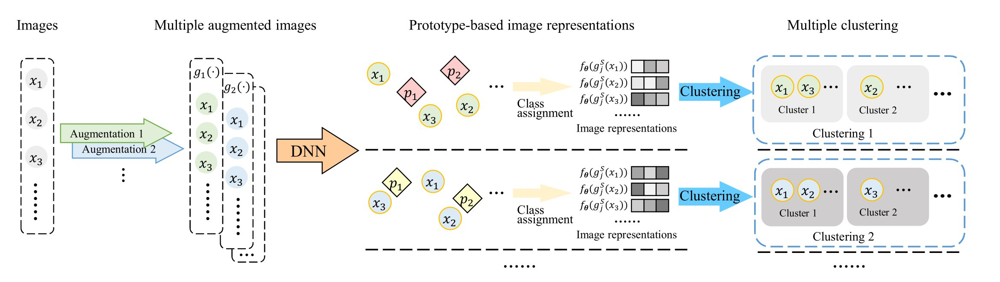

## AugDMC: Data Augmentation Guided Deep Multiple Clustering
Official PyTorch implementation for the INNS DLIA workshop at IJCNN 2023 paper.

Jiawei Yao, Enbei Liu, Maham Rashid, [Juhua Hu](http://faculty.washington.edu/juhuah/)*
\*corresponding author

Abstract: Clustering aims to group similar objects together while separating dissimilar ones apart. Thereafter, structures hidden in data can be identified to help understand data in an unsupervised manner. Traditional clustering methods such as k-means provide only a single clustering for one data set. Deep clustering methods such as auto-encoder based clustering methods have shown a better performance, but still provide a single clustering. However, a given dataset might have multiple clustering structures and each represents a unique perspective of the data. Therefore, some multiple clustering methods have been developed to discover multiple independent structures hidden in data. Although deep multiple clustering methods provide better performance, how to efficiently capture a user's interest is still a problem.how to efficiently capture the alternative perspectives in data is still a problem. In this paper,
we propose AugDMC, a novel data Augmentation guided Deep Multiple Clustering method, to tackle the challenge. Specifically, AugDMC leverages data augmentations to automatically extract features related to a certain aspect of the data using a self-supervised prototype-based representation learning, where different aspects of the data can be preserved under different data augmentations. Moreover, a stable optimization strategy is proposed to alleviate the unstable problem from different augmentations. Thereafter, multiple clusterings based on different aspects of the data can be obtained.Experimental results on three real-world datasets compared with state-of-the-art methods validate the effectiveness of the proposed method.

## Method
|  | 
|:--:| 
| ***Figure 1. Overall framework of AugDMC**. AugDMC uses multiple augmentation methods to obtain augmented images with desired characteristics. The representations of the augmented images are learned via a self-supervised prototype-based representation learning method. The final multiple clusterings can be obtained by employing any single clustering algorithm on the learned representations.* |

## Requirements
 - We recommend Linux for performance and compatibility reasons.
 - 1 NVIDIA GPUs. We developed and trained the model using RTX 2080 Ti(11GB).

## Getting started
### Datasets
- [x] Furit 
- [x] Furit360
- [x] Cards

https://drive.google.com/uc?export=download&id=1qQ3ohQgHur7sH2sjZpljaJQIJqz5o8aK

### Training
Pending

## Bibtex
Pending

## Acknowledgement
Yao and Hu's research is supported in part by Advata Gift Funding. All opinions, findings, conclusions and recommendations in this project are those of the author and do not necessarily reflect the views of the funding agencies. 
